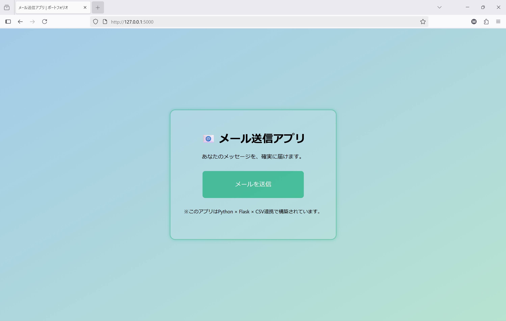
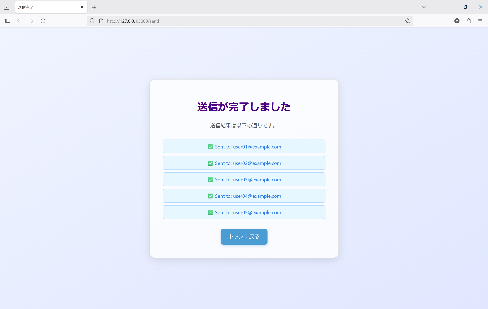
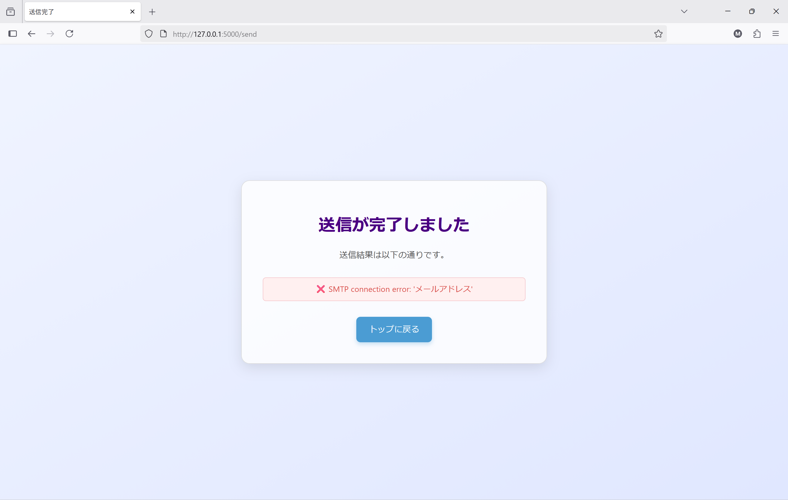

# 📧 FlaskでCSVからGmailを一括送信！業務効率化ツール

Flaskとpandasを用いて、CSVファイルからGmailを自動送信し、送信結果をUIで可視化するアプリです。  
合計5日間で完成させており、実務に近い構成で、メール業務の効率化を目指しています。

---

## 📌 プロジェクト名

**Flask × Excel連携による一括メール送信ツール**

---

## 🛠 使用技術

- Python（pandas, smtplib）
- Flask（ルーティング、テンプレート）
- HTML / CSS（Jinja2テンプレート）
- Excel / CSV（データソース）
- Gmail（SMTP送信）
- dotenv（環境変数管理）

🧩 開発環境補足：
- VS Code拡張機能：**Rainbow CSV**
- importエラー時は **Pylance** や **Python拡張機能** を再インストール

---

## 💡 工夫した点
CSS(HTMLに埋め込む形)でUIの視認性を強化

✅ / ❌ をJinja2で動的に表示し、送信成功・失敗を一目で判別可能

.envでGmail認証情報を管理し、セキュリティと再利用性を両立

time.sleep()で送信間隔を調整し、Gmailのスパム判定を回避

---

## 🖼️ アプリ画面イメージ

### ホーム画面
「メール送信アプリ」のトップページ。送信ボタンを押すだけで、CSVの内容に基づいてメールが送信されます。



### 送信成功画面
送信完了後、各メールアドレスへの送信結果が一覧表示されます（✅で成功を表示）。



### 送信エラー画面
SMTP接続エラーなどが発生した場合、赤いエラーメッセージで通知されます（❌で失敗を表示）。 
また、CSVファイルの区切り文字が正しく設定されていない場合（例：カンマ区切りがない）、pandasの読み込み時にエラーが発生します。
→ ファイルをカンマ区切り（`,`）に整形し直すことで、正常に読み込めるようになりました。



---

## 🔧 今後追加したい機能

- 送信履歴のDB保存（SQLiteなど）
- メールテンプレートの選択機能
- 送信前のプレビュー画面
- HTMLメール対応（MIMETextの `html` モード）
- 送信件数の統計表示

---

## 📂 CSVフォーマット例

| メールアドレス             | 件名     | 本文                     |
|---------------------------|----------|--------------------------|
| user01@example.com        | 【✨ごあいさつ】はじめましてのご連絡です   | 初めてご連絡させていただきます。どうぞよろしくお願いいたします！😊 |
| user02@example.com        | 【📢お知らせ】6月のわくわくイベントのご案内♪   | 6月のわくわくイベントのご案内♪6月に開催予定のイベントについて、詳細をご案内いたします。ぜひチェックしてくださいね！🌟 |
| user03@example.com        | 🗓️ご案内】7月の素敵な企画、いかがですか？   | 7月の素敵な企画、いかがですか？7月に行う予定の企画について、一足早くお知らせします！お楽しみに！🌻 |
| user04@example.com        | 💡お役立ち ちょっとしたヒントをお届けします   | 皆様のお役に立てるような、ちょっとした情報やヒントをお送りします。ご参考になれば嬉しいです！🌸 |
| user05@example.com        | 🌟感謝を込めて】いつもありがとうございます   | 日頃の感謝の気持ちを込めて、メッセージをお送りします。これからもどうぞよろしくお願いいたします！🙏 |

---

## 🧪 セットアップ手順

このアプリを実行するには、以下の準備が必要です。

① .env ファイルの作成

Gmailの認証情報を .env ファイルで管理しています。 セキュリティのため、Gitには含めていません。以下のような内容で .env を作成してください（.env.sample を参考にしてください）：

EMAIL_ADDRESS=your_email@example.com

EMAIL_PASSWORD=your_app_password

② 必要なライブラリのインストール

仮想環境を作成した上で、必要なライブラリをインストールしてください：

pip install flask pandas python-dotenv

または、requirements.txt がある場合：

pip install -r requirements.txt

（requirements.txtの内容：↓）

flask==2.3.2
pandas==2.1.1
python-dotenv==1.0.0

③.コードの再利用について（任意）

このプロジェクトで使用している HTMLテンプレートや Pythonコードは、  
Flaskを使ったメール送信・CSV処理の参考実装として再利用可能です。  
ご自身のプロジェクトに合わせて、必要な部分をコピー・編集してご活用ください。

🌟再利用ポイント：

- SendMail.py：CSV読み込みとメール送信ロジック

- templates/result.html：送信結果の表示テンプレート

- .env.sample：環境変数の雛形

> 💡 再利用時は、ファイル構成や変数名、`.env` の内容などを必ずご自身の環境に合わせて調整してください。

④アプリの起動

以下のコマンドでアプリを起動できます：

python SendMail.py

---

📌 CSV整形Tips：
```python
df['メールアドレス'] = df['メールアドレス'].str.strip()
